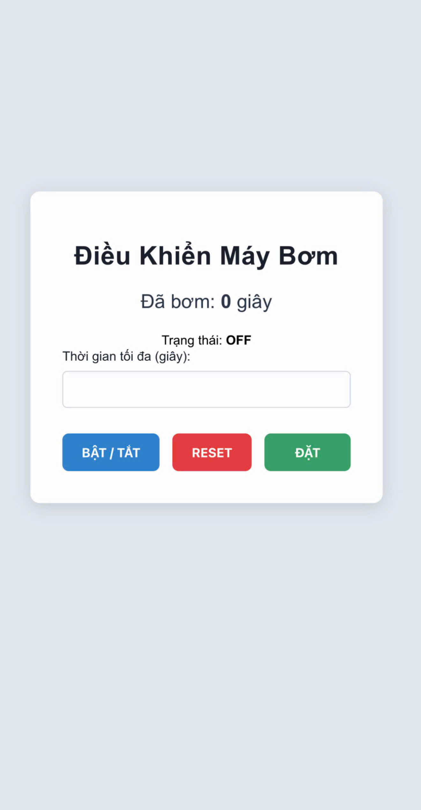
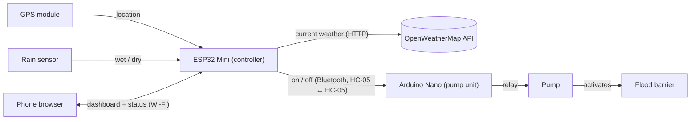

# FloodBarrier: Automatic Flood Barrier Controller (ESP32)

An ESP32 controller that activates a flood barrier automatically during heavy rain. It checks the live weather and a local rain sensor, switches on the pump that activates the barrier, and lets families watch and control it from their phones.

**Used by 50+ households in Vietnam** · Built March – August 2025


<p align="center">
  
</p>


Heavy rain can flood homes in Vietnam. The flood barrier is activated by a pump, and before this controller, families had to watch the weather and switch that pump on and off themselves. That was difficult when nobody was home.

## Features

- **Automatic barrier activation.** The device checks live OpenWeatherMap data for its GPS location. If the API reports heavy rain and the local rain sensor is wet, the pump starts and activates the barrier on its own. Nobody has to be home.
- **Phone dashboard.** The ESP32 hosts a web page on the home Wi-Fi. It shows whether the pump is on and how long it has run, with buttons for on/off and reset and a setting for maximum run time.
- **Run-time safety cutoff.** The pump stops automatically once it reaches the maximum run time set on the dashboard. The setting is saved to flash, so it survives power cuts.
- **Wireless pump link.** The controller sends on/off commands to the pump unit over Bluetooth (HC-05).
- **Setup without code.** Households connect to a setup hotspot and pick their Wi-Fi network in a captive portal (WiFiManager). The firmware never needs editing.
- **Local language.** The dashboard is in Vietnamese for the people who use it.

## How it works



Main loop:

1. Read the GPS module.
2. Once there is a GPS fix, request the current weather from OpenWeatherMap every 10 minutes.
3. If the API reports heavy rain (condition codes 202, 502–504 or 522) and the rain sensor reads wet, send `1` (on) to the pump unit, which activates the barrier.
4. While the pump runs, count the seconds. When the count reaches the maximum run time, send `0` (off). The pump then stays off until someone presses RESET on the dashboard.
5. Serve the dashboard and handle button presses from phones.

Every on/off command goes through one function, so the pump and the dashboard always show the same state.

## Hardware

The system has two parts that talk over Bluetooth: a **controller** that makes the decisions and a **pump unit** that switches the pump.

**Controller**

| Component | Role |
|---|---|
| ESP32 Mini | Main controller: Wi-Fi, web dashboard, weather check, run-time cutoff |
| HC-05 Bluetooth module | Sends on/off commands to the pump unit |
| GPS module (UART, 9600 baud) | Finds the location for the weather lookup |
| Analog rain sensor | Detects rain locally |

**Pump unit**

| Component | Role |
|---|---|
| Arduino Nano | Receives `1` / `0` from its HC-05 and drives the relay |
| HC-05 Bluetooth module | Paired with the controller's HC-05 |
| Relay module | Switches the pump that activates the barrier |

**Controller wiring**

| ESP32 pin | Connected to |
|---|---|
| GPIO 33 (ADC) | Rain sensor analog output |
| GPIO 22 (RX) | HC-05 TXD |
| GPIO 21 (TX) | HC-05 RXD |
| UART2 (`Serial2`) | GPS module |
| GPIO 0 (BOOT button) | Short press: show IP address · Hold 3 s: erase saved Wi-Fi |
| GPIO 2 | Status LED |

<!-- TODO: add a wiring diagram (docs/images/wiring.png) and the Arduino Nano pump-unit sketch. -->

## Tech stack

- **Firmware:** C++ (Arduino framework) on an ESP32 Mini (controller) and an Arduino Nano (pump unit)
- **Libraries:** WiFiManager, TinyGPSPlus, EspSoftwareSerial, ESP32 `WebServer` / `HTTPClient`
- **Web dashboard:** HTML, CSS and vanilla JavaScript, polling a JSON status endpoint
- **Protocols:** HTTP/REST and JSON, UART (GPS NMEA), Bluetooth serial
- **External API:** OpenWeatherMap Current Weather

## Getting started

### 1. Install the toolchain

1. Install [Arduino IDE 2](https://www.arduino.cc/en/software).
2. Go to **File → Preferences → Additional boards manager URLs** and add
   `https://espressif.github.io/arduino-esp32/package_esp32_index.json`
3. In **Boards Manager**, install **esp32 by Espressif Systems**, then select **ESP32 Dev Module** (this also works for ESP32 Mini boards).

### 2. Install the libraries

Install these from **Library Manager**:

| Library | Author | Used for |
|---|---|---|
| WiFiManager | tzapu | Wi-Fi setup portal |
| TinyGPSPlus | Mikal Hart | Parsing GPS data |
| EspSoftwareSerial | Dirk Kaar, Peter Lerup | Serial link to the HC-05 |

`WiFi`, `WebServer` and `HTTPClient` come with the ESP32 board package.

### 3. Add your secrets

```sh
cp CodeESP32/secrets.example.h CodeESP32/secrets.h
```

Then edit `secrets.h` and set:

- `OWM_API_KEY`: a free key from [openweathermap.org](https://openweathermap.org/api)
- `SETUP_AP_PASSWORD`: the password for the setup hotspot (8+ characters)

`secrets.h` is listed in `.gitignore`, so it is never committed.

### 4. Flash the board

Open `CodeESP32/CodeESP32.ino`, select the board and port, then click **Upload**.

### 5. First boot

1. The device opens a Wi-Fi hotspot called **Set Up Transmitter**. Join it from a phone using `SETUP_AP_PASSWORD`, then choose the home Wi-Fi network.
2. The LED blinks twice quickly if the connection worked. It blinks twice slowly if it failed, and the device then restarts and tries again.
3. Press **BOOT** briefly to open the **Check IP Address** hotspot. The device's IP address is on its *Info* page.
4. On a phone connected to the same Wi-Fi, open `http://<device-ip>/`.

## HTTP API

| Endpoint | Description |
|---|---|
| `GET /` | Dashboard page |
| `GET /status` | Status as JSON, e.g. `{"pumpOn":true,"pumpedSeconds":100,"maxRunSeconds":600}` |
| `GET /pump?state=on` | Turn the pump on (`state=off` turns it off) |
| `GET /reset` | Turn the pump off and reset the run-time counter |
| `GET /maxtime?seconds=600` | Set the maximum run time (1–86400 s), saved to flash |

Every endpoint except `/` replies with the same status JSON.

## Project structure

```
FloodBarrier/
├── CodeESP32/
│   ├── CodeESP32.ino        # Firmware: sensors, weather check, pump logic, web server
│   ├── webControlESP.h      # Dashboard (HTML/CSS/JS) served by the ESP32
│   └── secrets.example.h    # Template for the API key and hotspot password
├── .gitignore
└── README.md
```

## Roadmap

- Over-the-air (OTA) firmware updates for units already installed
- A water-level sensor, to measure flooding directly
- Use forecast data to start pumping before heavy rain arrives
- HTTPS for API calls and a password-protected dashboard

## Author

**Thang Phung** · [@pqthangv](https://github.com/pqthangv)

Sole developer. I designed and built the whole system: the ESP32 firmware, the phone dashboard and the hardware integration.
